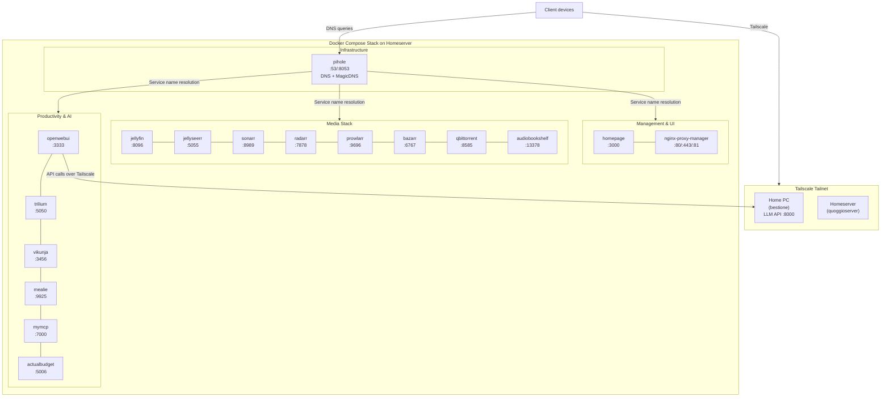

# HomeServer (Ansible)

This repository contains Ansible playbooks and roles to provision and manage my personal home server. The entire setup runs as Docker containers via a single Docker Compose file generated from Ansible templates.

## Overview

My home server runs a comprehensive media management and personal productivity stack, with all services containerized and orchestrated through Docker Compose. The server integrates with Tailscale for secure networking and uses Pi-hole for DNS management and local service resolution.

## Architecture

### Networking

- **Tailscale**: The server is part of a private Tailscale tailnet for secure remote access
- **Pi-hole**: Acts as the primary DNS server and provides local hostname resolution (replacing MagicDNS)
- **Docker Network**: All containers communicate through a shared `proxy-network`
- **Cross-machine Communication**: OpenWebUI can communicate with a self-hosted LLM API running on my home PC (`bestione:8000`)

### Infrastructure

The setup uses Ansible to:

1. Define each service as an Ansible task that sets a `*_service` fact (image, ports, volumes, environment, networks)
2. Combine all service definitions into a unified `services` list
3. Render a Docker Compose file from the `compose.yml.j2` template
4. Deploy everything with `docker compose up`

## Services

### 🏠 Dashboard & Management

- **Homepage** (`:3000`) - Service dashboard and homepage
- **Nginx Proxy Manager** (`:80/:443/:81`) - Reverse proxy (legacy, Pi-hole now handles most routing)

### 🎬 Media Management Stack

- **Jellyfin** (`:8096`) - Media server for movies and TV shows
- **Jellyseerr** (`:5055`) - Media request management
- **Sonarr** (`:8989`) - TV show management and automation
- **Radarr** (`:7878`) - Movie management and automation  
- **Prowlarr** (`:9696`) - Indexer management for *arr stack
- **Bazarr** (`:6767`) - Subtitle management
- **qBittorrent** (`:8585` + `:6881`) - Torrent client
- **Audiobookshelf** (`:13378->80`) - Audiobook and podcast server

### 🤖 AI & Productivity

- **OpenWebUI** (`:3333->8080`) - Web interface for LLM interaction (connects to home PC LLM API)
- **MyMCP** (`:7000`) - Personal MCP (Model Context Protocol) server
- **Trilium** (`:5050->8080`) - Note-taking and knowledge management

### 🏡 Personal Applications  

- **Actual Budget** (`:5006`) - Personal finance management
- **Vikunja** (`:3456`) - Task and project management
- **Mealie** (`:9925->9000`) - Recipe management with AI integration

### 🔧 Infrastructure Services

- **Pi-hole** (`:53` DNS, `:8053` Web UI) - Network-wide ad blocking and DNS server

## Deployment

The deployment follows this workflow:

1. **Service Definition**: Each service is defined in `roles/containers/tasks/<service>.yml`
2. **Template Rendering**: The `compose.yml.j2` template iterates over all services to generate the final Docker Compose file
3. **Deployment**: Ansible runs `docker compose up -d` to deploy all services

### Key Files

- `roles/containers/templates/compose.yml.j2` - Docker Compose template
- `roles/containers/tasks/setup.yml` - Combines all services and renders compose file
- `roles/containers/tasks/run.yml` - Deploys the stack
- `roles/containers/tasks/<service>.yml` - Individual service definitions

### Running the Deployment

```bash
# Deploy the entire stack
ansible-playbook site.yml

# Or run specific roles
ansible-playbook site.yml --tags containers
```

## Network Diagram



## Configuration

Services are configured through environment variables and volume mounts defined in their respective Ansible tasks. Key configuration points:

- **Timezone**: Most services use `Europe/Rome`
- **User/Group IDs**: Services run as `PUID=1000` and `PGID=1000`
- **Storage**: Media stored in `/media/`, service data in `./service-name/` directories
- **AI Integration**: OpenWebUI and Mealie connect to LLM API at `http://bestione:8000/v1`
